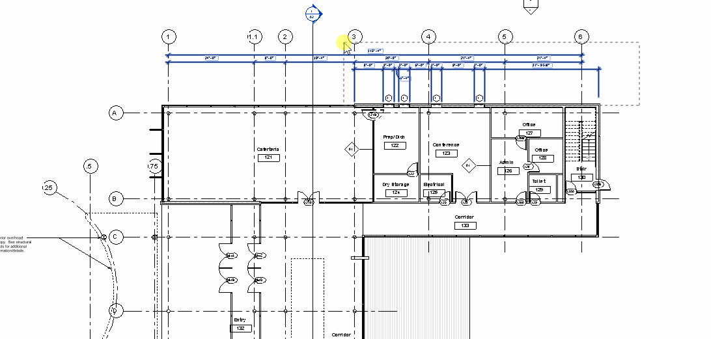

# Revit-Kit -UNDER CONSRTUCTION- 
Revit tool chest for practicality improvement. 

## Basic Explanation / Usage of Commands :

#### J_TRIM  
-Function        : Trim elements the regular way. \
-Purpose         : Practicality by eliminating User input.

#### J_SELDEL_PT
-Function        : Delete 3DPoints in selected objects. \
-Purpose         : Point cloud manipulation. 

#### J_SELECTSIMILAR
-Function        : Selects same <objecttype> objects with similar properties. \
-Purpose         : Model manipulation. 
  
#### J_SELDEL_DIM
-Function        : Delete Dimensions in selected region. \
-Purpose         : Eliminating unnecessary annotation objects. ↓  
  

