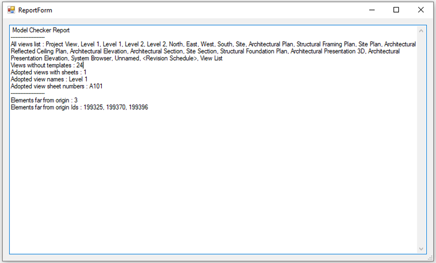
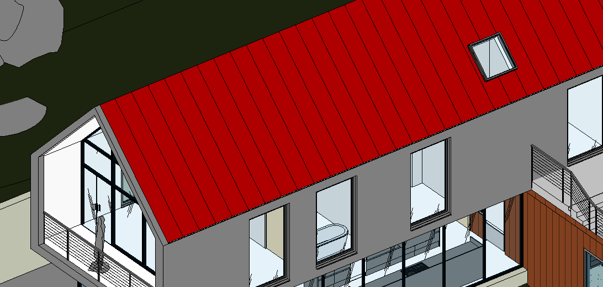

# Revit-Kit 
Revit tool chest for practicality improvement. 

## Basic Explanation / Usage of Commands :

#### J_MODELCHECKER 
-Function        : Querries the model for issues and reports them. \
-Purpose         : Enforce quality control.

#### J_QRCODER 
-Function        : Adds timestamp to model in QR code format. \
-Purpose         : Making the model revision-proof by 3rd parties.

#### J_QRDECODER 
-Function        : Checks valid timestamp of model created with deployment. \
-Purpose         : Making the model revision-proof by 3rd parties.

#### J_VIEWTOFACE 
-Function        : Orients active view according to a selected face. \
-Purpose         : Smoother 2D operations on 3D models.

#### J_TRIM  -UNDER CONSRTUCTION-
-Function        : Trim elements the regular way. \
-Purpose         : Practicality by eliminating User input.

#### J_SELDEL_PT
-Function        : Delete 3DPoints in selected objects. \
-Purpose         : Point cloud manipulation. 

#### J_SELECTSIMILAR  -UNDER CONSRTUCTION-
-Function        : Selects same <objecttype> objects with similar properties. \
-Purpose         : Model manipulation. 
  
#### J_SELDEL_DIM
-Function        : Delete Dimensions in selected region. \
-Purpose         : Eliminating unnecessary annotation objects. ↓  
  

